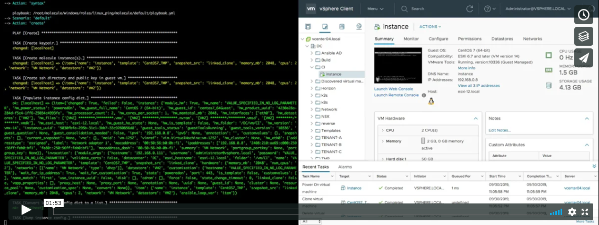
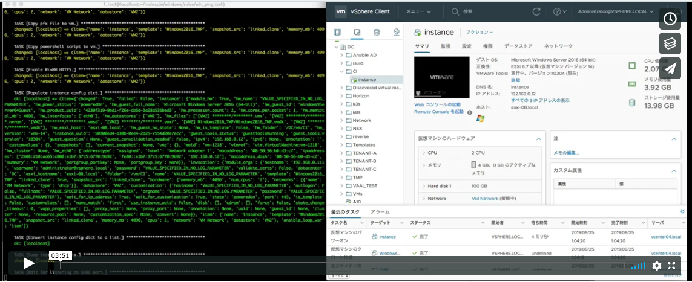

[](https://opensource.org/licenses/MIT)

# Sample for create molecule test instance on VMware

This is a sample to create a test instance of molecule on VMware environment.
Samples for Linux and Windows are prepared.

## How to create molecule test instance on VMware environment

### Requirements

To create a test instance required following.

* vCenter Server
* template vm
* template vm snapshot

The reason required a snapshot is because test instances are created with a linked clone.

### Run the sample

The sample this repository provides Linux (linux_ping) and Windows (win_ping) roles.
To run the sample, change the variable in the molecule.yml file.

|    os   |               molecule.yml path                |
|---------|------------------------------------------------|
| linux   | roles/linux_ping/molecule/default/molecule.yml |
| windows | roles/win_ping/molecule/default/molecule.yml   |

#### Variables for Linux

```yaml
---
dependency:
  name: galaxy
driver:
  name: delegated
  hostname: vCenter IP or hostname        # Please change here to vCenter IP or hostname.
  username: administrator@vsphere.local   # Please change here to vCenter login username.
  password: password                      # Please change here to vCenter login user password.
  validate_certs: false
  datacenter: datacenter name             # Please change here to data center name to use
  esxi_hostname: esxi hostname            # Please change here to esxi hostname to use
  folder: folder path(ex: /vm)            # Please change here to folder path to save the linked clone.
  vm_username: username for guest os      # Please change here to user name created in the template.(ex: root)
  vm_password: password for guest os      # Please change here to user password in the template.
  options:
    ansible_connection_options:
      connection: ssh
lint:
  name: yamllint
platforms:                                # Define an instance to use for role test.
  - name: instance                        # Please change here to instance name for test.
    template: template name               # Please change here to template name use in the linked clone.
    snapshot_src: snapshot for template   # Please change here to snapshot name of template use in linked clone.
    memory_mb: 2048                       # Please change here to memory size to use.
    cpus: 2                               # Please change here to CPU core count to use.
    network: VM network                   # Please change here to network name to use.
    datastore: datastore name             # Please change here to datastore name to use.
provisioner:
  name: ansible
  log: true
verifier:
  name: testinfra
  lint:
    name: flake8
```

#### Variables for Windows

```yaml
---
dependency:
  name: galaxy
driver:
  name: delegated
  hostname: vCenter IP or hostname        # Please change here to vCenter IP or hostname.
  username: administrator@vsphere.local   # Please change here to vCenter login username.
  password: password                      # Please change here to vCenter login user password.
  validate_certs: false
  datacenter: datacenter name             # Please change here to data center name to use
  esxi_hostname: esxi hostname            # Please change here to esxi hostname to use
  folder: folder path(ex: /vm)            # Please change here to folder path to save the linked clone.
  vm_username: username for guest os      # Please change here to user name created in the template.(ex: administrator)
  vm_password: password for guest os      # Please change here to user password in the template.
  connection: winrm
  port: 5986
  winrm_transport: ntlm
  winrm_server_cert_validation: ignore
lint:
  name: yamllint
platforms:                                # Define an instance to use for role test.
  - name: instance                        # Please change here to instance name for test.
    template: template name               # Please change here to template name use in the linked clone.
    snapshot_src: snapshot for template   # Please change here to snapshot name of template use in linked clone.
    memory_mb: 4096                       # Please change here to memory size to use.
    cpus: 2                               # Please change here to CPU core count to use.
    network: VM Network                   # Please change here to network name to use.
    datastore: datastore name             # Please change here to datastore name to use.
provisioner:
  name: ansible
  lint:
    name: ansible-lint
  log: true
verifier:
  name: testinfra
  lint:
    name: flake8
```

#### When creating multiple test instances

Define multiple platforms as in the following example.

```yaml
(snip)
platforms:
  - name: instance1
    template: template name
    snapshot_src: snapshot for template
    memory_mb: 2048
    cpus: 2
    network: VM Network
    datastore: datastore name
  - name: instance2
    template: template name
    snapshot_src: snapshot for template
    memory_mb: 2048
    cpus: 2
    network: VM Network
    datastore: datastore name
(snip)
```

#### Demo

The following is a demo when the sample is run.

**Linux**

[](https://player.vimeo.com/video/363311040?quality=1080p)

**Windows**

[](https://player.vimeo.com/video/362086923?quality=1080p)

### How to use it for testing other roles

Test with other roles is easy.
Copy each molecule directory to the role to be test.
It is `roles/linux_ping/molecule/` for Linux and `roles/win_ping/molecule` for Windows.
After copying the directory, change the variable file and run the `molecule test` command.

# License

MIT

# Author Information

This samples was created by [sky-joker](https://github.com/sky-joker).
